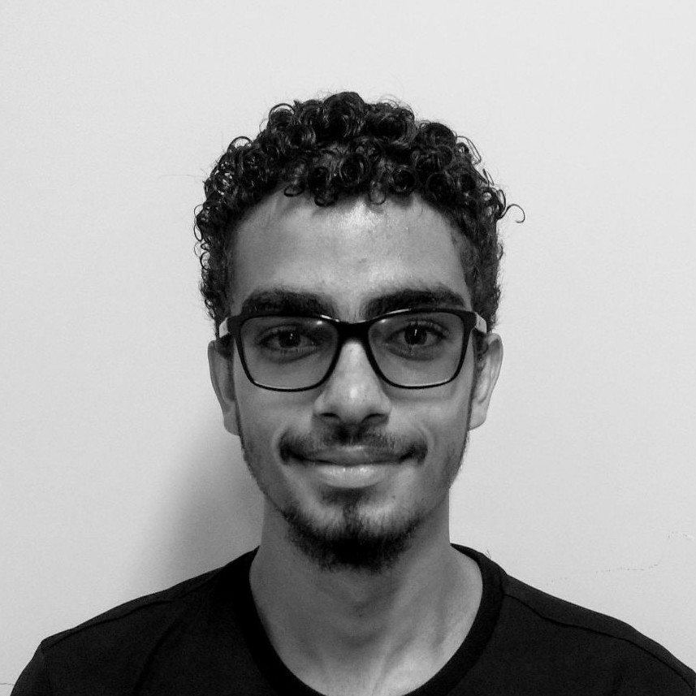

 <!-- home page -->

# cp-tools

Este projeto é voltado para a disciplina de Requisitos de Software e visa levantar novos requisitos para a ferramenta **cp-tools**. O projeto de desenvolvimento do **`cp-tools`** é uma iniciativa do Prof. Edson Alves da Costa Junior, da Faculdade de Engenharia UnB Gama, e surgiu como alternativa de solução para a ausência de ferramentas de desenvolvimento de problemas para maratonas de programação. O **`cp-tools`** é uma ferramenta de CLI (Interfaces de Linhas de Comando), que se propõe auxiliar os processos de formatação, testagem e empacotamento de problemas de maratona competitiva.

## Equipe
| Foto | 
Nome | Email | GitHub |
| :----: | :---- | :-----: | :------: |
|  | Durval Carvalho de Souza	 | dudurval2@gmail.com | [@durvalcarvalho](https://github.com/durvalcarvalho) |
|  | Ingrid Soares | ingr.dcg@gmail.com |  |
|  | João Victor de Oliveira Matos	 | joao15victor08@gmail.com | [@joao15victor08](https://github.com/joao15victor08) |
|  | Rafaella Oliveira de Faria Junqueira	 | 	rafaellafjunqueira@gmail.com | [@RafaellaJunqueira](https://github.com/RafaellaJunqueira) |
