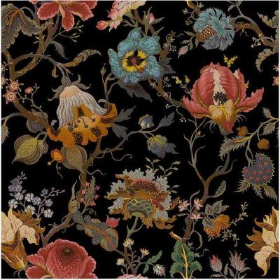

# 
Sobre o projeto

#### Histórico de Versão
|    Data    | Versão | Descrição            | Autor(es)       |
| :--------: | :----: | :------------------: | :-------------: |
| 07.10.2020 |  0.1   | Criação do documento | Durval Carvalho |

## Introdução e Objetivos

Esse documento tem por finalidade apresentar o projeto a interessados na ferramenta `cp-tools` e no projeto. Primeiro será contextualizado sobre a aplicação `cp-tools`, tópicos a respeito da motivação que incentivou o desenvolvimento da ferramenta, os atuais contribuidores, suas funcionalidades principais, e o público alvo do software. Em seguida será apresentando os membros do projeto, e por fim será apresentando os resultados esperados na conclusão do projeto.

## Sobre o cp-tools

O projeto chamado `cp-tools` é uma iniciativa desenvolvida pelo Prof. Edson Alves da Costa Junior, da Faculdade de Engenharia UnB Gama. Esse projeto surgiu devido a falta de ferramentas no processos de desenvolvimento de problemas de maratonas de programação. Essa falta de ferramentas fez com que cada criador de problemas de maratona desenvolvesse suas próprias ferramentas, com sua próprias peculiaridades, dificultando assim a colaboração entre os membros.

A ferramenta `cp-tools` é uma aplicação de linha de comando (CLI), ou seja, não possui interface gráfica. Sua principais funcionalidades é a capacidade de gerar arquivos PDF, HTML e LaTEX com base em arquivos Markdown, sua capacidade de averiguar se um conjunto de scripts se comporta da maneira esperada e sua capacidade de exportar pacotes de problemas para upload em diversos sites de maratona de programação.

O `cp-tools` está em fase de desenvolvimento, ainda não possuindo uma versão estável em produção. Atualmente o projeto é mantido somente por um desenvolvedor, o Prof. Edson. Os potenciais usuários da aplicação é a comunidade de maratona de programação, sendo esta composta em sua grande maioria por alunos e professores universitários, mas também contando com entusiastas de maratonas de programação.

## Membros da Equipe

A equipe é formada por 4 graduandos do curso de Engenharia de Software da Universidade de Brasília, da Faculdade Gama (FGA).

Foto | Nome | Email | GitHub |
 ---- | ---- | ----- | ------ |
 | Durval Carvalho de Souza	 | dudurval2@gmail.com | [@durvalcarvalho](https://github.com/durvalcarvalho) |
 | Ingrid Soares | ingr.dcg@gmail.com | [@ingrdst](https://github.com/ingrdst) |
 | João Victor de Oliveira Matos	 | joao15victor08@gmail.com | [@joao15victor08](https://github.com/joao15victor08) |
 | Rafaella Oliveira de Faria Junqueira | 	rafaellafjunqueira@gmail.com | [@RafaellaJunqueira](https://github.com/RafaellaJunqueira) |

## Objetivos do projeto

O nosso projeto tem como objetivo criar uma documentação abrangente relacionada aos requisitos da aplicação, de modo que facilite a contribuição de futuros mantenedores e contribuidores do projeto. 

Além de criação da documentação dos requisitos, esse projeto também tem como objetivo implementar um grupo de requisitos no software. No momento que esse documento foi escrito, ainda não está definido qual será esse grupo de requisito. Primeiro será  elicitiado e priorizado os requisitos, de modo que, o conjunto escolhido tenha o maior impacto positivo para o projeto `cp-tools`. 

Com dito anteriormente, ainda não está definido o que será implementado, porém algumas sugestões de funcionalidades já foram sugeridas, como por exemplo:
- Suporte a um novo tipo de empacotamento
- Criação de uma interface gráfica
- Criação de mais Testers de problemas de maratona
- Suporte a mais soluções de problemas em outras linguagens de programação
- Suporte a novas opções de CLI

